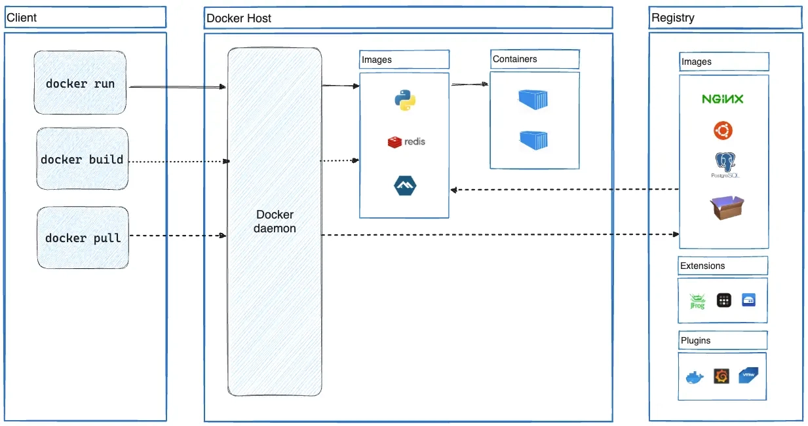

# Docker 정리

## 1. Docker가 등장한 이유

애플리케이션은 코드만 있다고 실행되는 것이 아니다.

실제로 실행하려면 Java 버전, JVM 버전, 환경 변수, 설정 파일, DB 접속 정보, 포트, 드라이버, 외부 프로그램 같은 실행 환경이 필요하다.

서버마다 실행 환경이 조금씩 다르면 다음과 같은 문제가 생긴다.

```text
내 컴퓨터에서는 정상 동작
운영 서버에서는 오류 발생
```

즉, 애플리케이션은 하드웨어와 운영체제에 대한 종속을 줄여 왔지만, 여전히 실행 환경과 설정에 영향을 받는다.

이 문제를 줄이기 위해 가상 머신, 즉 VM이 사용되었다.

## 2. VM과 Docker의 차이

VM은 하나의 물리 서버 위에 가상의 컴퓨터를 만드는 방식이다. VM 안에는 독립적인 운영체제가 포함된다.

```text
하드웨어
 -> 호스트 OS
 -> 가상화 소프트웨어
 -> 게스트 OS
 -> 애플리케이션
```

VM은 실행 환경을 통째로 묶을 수 있다는 장점이 있지만, OS 전체를 포함하기 때문에 무겁다.

VM의 단점은 다음과 같다.

- VM마다 별도의 OS가 필요하다.
- 용량이 크다.
- 부팅 시간이 오래 걸린다.
- CPU, 메모리 같은 자원을 미리 할당해야 한다.
- 여러 VM을 실행하면 자원 사용량이 크다.

Docker는 VM의 무거움을 줄이면서도 독립적인 실행 환경을 제공하기 위해 등장했다.

Docker는 컨테이너 기술을 사용한다.

```text
하드웨어
 -> 호스트 OS
 -> Docker Engine
 -> 컨테이너
 -> 애플리케이션
```

Docker 컨테이너는 VM처럼 별도의 OS를 통째로 가지지 않는다. 대신 호스트 OS의 커널을 공유한다.

```text
VM: OS 전체를 가상화
Docker: 호스트 OS 커널을 공유하고 실행 환경만 격리
```

그래서 Docker는 VM보다 가볍고 빠르다.

## 3. Docker란?

Docker는 컨테이너 기술을 활용하여 애플리케이션을 실행하고 배포할 수 있게 해주는 플랫폼이다.

Docker를 사용하면 애플리케이션 코드뿐만 아니라 실행에 필요한 환경까지 이미지로 묶을 수 있다.

```text
애플리케이션 + 실행 환경 + 설정
 -> Docker 이미지
 -> Docker 컨테이너로 실행
```

Docker의 핵심 목적은 어디서 실행하든 같은 환경을 제공하는 것이다.

```text
개발자 PC에서 실행한 환경
= 테스트 서버에서 실행한 환경
= 운영 서버에서 실행한 환경
```

## 4. Docker 핵심 개념

### 이미지

이미지는 컨테이너를 실행하기 위해 필요한 모든 것을 담아 둔 실행 패키지다.

이미지 안에는 애플리케이션 코드, 라이브러리, 설정 파일, 실행 명령 등이 포함될 수 있다.

```text
이미지 = 컨테이너를 만들기 위한 설계도
```

이미지는 실행 전 상태의 읽기 전용 템플릿이다.

예를 들어 `mysql:8` 이미지는 MySQL을 실행하기 위한 파일과 설정이 들어 있는 패키지다.

### 컨테이너

컨테이너는 이미지를 실행한 상태다.

이미지가 설계도라면 컨테이너는 실제로 실행 중인 애플리케이션 인스턴스다.

```text
이미지 -> 실행 -> 컨테이너
```

예를 들어 다음 명령은 `nginx` 이미지를 실행해서 컨테이너를 만든다.

```bash
docker run nginx
```

컨테이너는 격리된 파일 시스템과 네트워크 환경을 가지며, 다른 컨테이너와 독립적으로 실행된다.

### Dockerfile

Dockerfile은 Docker 이미지를 어떻게 만들지 적어두는 설정 파일이다.

```text
Dockerfile -> docker build -> Docker Image -> docker run -> Container
```

예를 들어 Java 애플리케이션용 Dockerfile은 다음처럼 작성할 수 있다.

```dockerfile
FROM amazoncorretto:21-alpine-jdk

WORKDIR /app

COPY build/libs/*.jar app.jar

ENTRYPOINT ["java", "-jar", "app.jar"]
```

각 명령의 의미는 다음과 같다.

- `FROM`: 어떤 기본 환경에서 시작할지 정한다.
- `WORKDIR`: 컨테이너 내부의 작업 디렉터리를 정한다.
- `COPY`: 내 컴퓨터의 파일을 이미지 안으로 복사한다.
- `ENTRYPOINT`: 컨테이너가 실행될 때 실행할 명령을 정한다.

위 Dockerfile은 다음 의미를 가진다.

```text
Java 21이 설치된 Alpine 기반 환경에서 시작
컨테이너 내부 작업 위치를 /app으로 설정
build/libs/*.jar 파일을 app.jar라는 이름으로 복사
컨테이너 실행 시 java -jar app.jar 실행
```

### Docker Hub

Docker Hub는 Docker 이미지를 저장하고 공유하는 공개 저장소다.

이미지를 다운로드할 때는 `docker pull`, 이미지를 업로드할 때는 `docker push` 명령을 사용한다.

```bash
docker pull nginx
docker push my-image
```

## 5. Docker build, pull, run

Docker 명령은 역할에 따라 구분해서 이해하면 좋다.

```text
이미지를 직접 만든다: docker build
이미지를 받아온다: docker pull
이미지를 실행한다: docker run
```

### docker build

`docker build`는 Dockerfile을 읽어서 이미지를 만드는 명령이다.

```bash
docker build -t example-part4 .
```

의미는 다음과 같다.

```text
현재 폴더의 Dockerfile을 읽어서
example-part4라는 이름의 Docker 이미지를 만들어라
```

여기서 `-t`는 이미지 이름 또는 태그를 붙이는 옵션이다.

```bash
docker build -t example-part4:1.0 .
```

이렇게 버전을 붙일 수도 있다.

### docker pull

`docker pull`은 Docker Hub 같은 Registry에서 이미지를 다운로드하는 명령이다.

```bash
docker pull nginx
```

이 명령은 `nginx` 이미지를 내 컴퓨터로 받아온다.

### docker run

`docker run`은 이미지를 실행해서 컨테이너를 만드는 명령이다.

```bash
docker run nginx
```

만약 내 컴퓨터에 `nginx` 이미지가 없다면 Docker는 자동으로 이미지를 먼저 다운로드한 뒤 컨테이너를 실행한다.

```text
1. 로컬에 nginx 이미지가 있는지 확인
2. 없으면 Docker Hub에서 nginx 이미지 다운로드
3. nginx 이미지로 컨테이너 실행
```

## 6. 이미지 이름과 컨테이너 이름

이미지 이름은 Dockerfile 안에 직접 적는 것이 아니라, 보통 `docker build -t` 명령으로 붙인다.

예를 들어 Dockerfile이 다음과 같다고 해보자.

```dockerfile
FROM nginx:alpine
COPY index.html /usr/share/nginx/html/index.html
```

이 Dockerfile에는 `my-nginx`라는 이름이 없다.

이미지 이름은 빌드할 때 붙인다.

```bash
docker build -t my-nginx .
```

```text
Dockerfile 내용 -> docker build -t my-nginx . -> my-nginx 이미지 생성
```

반면 컨테이너 이름은 `docker run --name`으로 붙인다.

```bash
docker run --name my-nginx nginx
```

이 경우 `my-nginx`는 이미지 이름이 아니라 컨테이너 이름이다.

정리하면 다음과 같다.

```text
docker build -t my-nginx .
=> my-nginx라는 이미지 생성

docker run my-nginx
=> my-nginx 이미지로 컨테이너 실행

docker run --name my-nginx nginx
=> nginx 이미지로 실행하되, 컨테이너 이름을 my-nginx로 지정
```

## 7. 포트 매핑

컨테이너 안에서 웹 애플리케이션이 실행되어도, 기본적으로 내 컴퓨터에서 바로 접근할 수 없다.

컨테이너 내부 포트를 내 컴퓨터의 포트와 연결해야 한다.

```bash
docker run -p 8080:8080 example-part4
```

의미는 다음과 같다.

```text
내 컴퓨터의 8080 포트 -> 컨테이너 내부의 8080 포트
```

만약 내 컴퓨터에서 이미 8080 포트를 사용 중이라면 앞쪽 포트를 바꿀 수 있다.

```bash
docker run -p 8081:8080 example-part4
```

```text
내 컴퓨터의 8081 포트 -> 컨테이너 내부의 8080 포트
```

정리하면 다음과 같다.

```text
콘솔 프로그램이면:
docker run 이미지이름

Spring Boot 같은 웹 애플리케이션이면:
docker run -p 호스트포트:컨테이너포트 이미지이름
```

## 8. Java 애플리케이션 Docker 실행 흐름

Spring Boot 애플리케이션을 Docker로 실행할 때는 보통 다음 순서로 진행한다.

```bash
./gradlew clean build
docker build -t example-part4 .
docker run -p 8080:8080 example-part4
```

흐름은 다음과 같다.

```text
./gradlew clean build
-> build/libs/*.jar 생성

docker build -t example-part4 .
-> Dockerfile을 읽어서 이미지 생성
-> build/libs/*.jar 파일을 이미지 안에 app.jar로 복사

docker run -p 8080:8080 example-part4
-> 컨테이너 실행
-> java -jar app.jar 실행
-> 내 컴퓨터 8080 포트로 접속 가능
```

여기서 이미지 이름은 자유롭게 정할 수 있다.

```bash
docker build -t jdk-21 .
```

이 명령에서 `jdk-21`은 공식 Java 이미지 이름이 아니라, 내가 만든 이미지에 붙인 이름이다.

다만 실제로는 `jdk-21`보다 애플리케이션 이름을 쓰는 편이 덜 헷갈린다.

```bash
docker build -t example-part4 .
```

## 9. Docker Architecture



Docker는 크게 Docker Client, Docker Daemon, Image, Container, Registry로 구성된다.

### Docker Client

Docker Client는 사용자가 Docker 명령을 입력하는 인터페이스다.

예를 들어 다음 명령을 입력하면 Docker Client가 Docker Daemon에게 요청을 보낸다.

```bash
docker run nginx
```

Docker Client 자체가 컨테이너를 직접 실행하는 것은 아니다. 실제 작업은 Docker Daemon이 수행한다.

### Docker Daemon

Docker Daemon은 Docker의 핵심 서버 프로세스다.

Docker Client로부터 요청을 받아 이미지, 컨테이너, 네트워크, 볼륨을 실제로 관리한다.

Docker Daemon의 주요 역할은 다음과 같다.

- 이미지 다운로드 및 관리
- 컨테이너 생성, 실행, 중지, 삭제
- 컨테이너 네트워크 관리
- 컨테이너 볼륨 관리
- Docker API 제공

```text
사용자 -> Docker Client -> Docker Daemon -> 컨테이너 실행
```

### Docker Image

Docker Image는 컨테이너 실행에 필요한 파일 시스템과 애플리케이션 코드를 포함한 템플릿이다.

이미지는 Layer 구조를 가진다. 같은 이미지를 기반으로 여러 컨테이너를 만들 수 있다.

### Docker Container

Docker Container는 독립적으로 실행되는 애플리케이션 인스턴스다.

각 컨테이너는 자체 파일 시스템, 프로세스 공간, 네트워크 인터페이스를 가진다. 하지만 커널은 호스트 OS와 공유한다.

컨테이너는 `docker run` 명령으로 생성하고 실행할 수 있다.

### Docker Registry

Docker Registry는 Docker 이미지를 저장하고 배포하는 저장소다.

대표적인 Registry는 다음과 같다.

- Docker Hub
- Amazon ECR
- Google Container Registry
- Private Registry

이미지를 받을 때는 `docker pull`, 이미지를 올릴 때는 `docker push`를 사용한다.

### Storage & Networking

컨테이너는 기본적으로 삭제되면 내부 데이터도 함께 사라진다. 데이터를 유지하려면 별도의 저장소 설정이 필요하다.

Docker에서 사용하는 주요 저장 방식은 다음과 같다.

- Volume
- Bind Mount
- tmpfs

컨테이너 간 통신이나 외부 접속을 위해 Docker는 네트워크 기능도 제공한다.

대표적인 네트워크 드라이버는 다음과 같다.

- Bridge
- Host
- Overlay

## 10. 한 줄 정리

Docker는 애플리케이션과 실행 환경을 이미지로 묶고, 그 이미지를 컨테이너로 실행해서 어디서든 비슷한 환경으로 애플리케이션을 실행할 수 있게 해주는 플랫폼이다.

```text
Dockerfile -> Image -> Container
```
