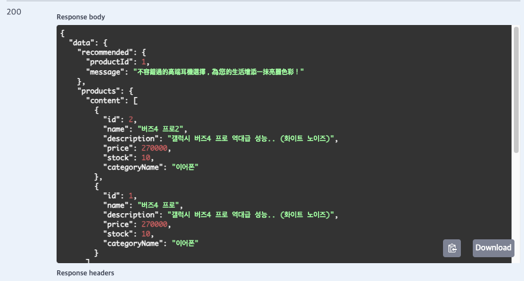

# Oliama란 무엇인가?
로컬에서 LLM(AI 모델)을 직접 실행할 수 있는 도구예

## Oliama 설치 (docker)

```text
docker run -d -v ollama:/root/.ollama -p 11434:11434 --name ollama ollama/ollama
```
- `v ollama:/root/.ollama`: 다운로드한 모델 파일을 컨테이너가 삭제되어도 유지
- `p 11434:11434`: 외부(Spring Boot 등)에서 Ollama 서비스에 접속할 수 있도록 포트를 연다.

**Oliama 실행** 
```text
docker exec -it ollama ollama run qwen2.5:3b

```

**설치된 모델 목록 확인**
```bash
docker exec -it ollama ollama list

# 출력 예시
# NAME              ID              SIZE      MODIFIED
# qwen2.5:3b        f6a123bc456d    2.3 GB    1 minute ago
```

## Spring AI OLLAMA 통합
로컬에서 구동 중인 Ollama 엔진을 Spring Boot 애플리케이션에 연결

### Dependencies 추가
```text
dependencyManagement {
	imports {
		mavenBom "org.springframework.cloud:spring-cloud-dependencies:2023.0.2"
		// Spring AI 추가
		mavenBom "org.springframework.ai:spring-ai-bom:1.0.0-M6"
	}
}


dependencies {
    // Ollama 연동을 위한 스타터
    implementation 'org.springframework.ai:spring-ai-ollama-spring-boot-starter'
}
```

### application.yml 설정

```text
spring:
  application:
    name: lesson

  ai:
    openai: # 유지
      # 1. API 키: Google AI Studio에서 발급받은 키를 입력합니다.
      # ${GOOGLE_AI_GEMINI_API_KEY}
      api-key: GOOGLE_AI_GEMINI_API_KEY
      chat:
        # 2. Base URL: Google Gemini가 제공하는 OpenAI 호환 API 주소입니다.
        base-url: "https://generativelanguage.googleapis.com/v1beta/openai/"
        options:
          # 모델명: 현재 가장 최신/경량 모델인 gemini-2.0-flash-lite 등을 지정합니다.
          model: "gemini-2.5-flash-lite"
          # 온전성(Temperature): 0.0은 가장 보수적이고 사실적인 답변을 생성합니다.
          # (분석, 요약, 데이터 추출에 최적화된 설정)
          temperature: 0.7

        # 4. 엔드포인트 경로: 대화형 API를 호출하기 위한 표준 경로입니다.
        completions-path: "/chat/completions"

    ollama: # 추가
      # Ollama 서버 주소 (도커 포트 포워딩 11434 확인)
      base-url: http://localhost:11434
      chat:
        options:
          # 우리가 설치하고 테스트한 모델명
          model: qwen2.5:3b
          # 창의성 조절 (0.7은 일반적인 대화에 적합)
          temperature: 0.7
          
          # 3. 샘플링 제어 (Top-K, Top-P) - 방금 학습한 내용!
          # 확률 상위 40개 후보군으로 제한
          top-k: 40
          # 누적 확률 90% 이내의 단어만 선택
          top-p: 0.9
          
          # 4. 답변 길이 및 품질 제어
          # 답변의 최대 토큰(단어 조각) 수를 제한 (너무 짧으면 답변이 끊김)
          num-predict: 10000
          # 동일한 문구 반복을 방지하는 정도 (1.1 이상 권장)
          repeat-penalty: 1.1
```

## 코드
**Controller**
```java
@RestController
@RequiredArgsConstructor
@RequestMapping("/api/ai/ollama")
public class OllamaController {

  private final OllamaService ollamaService;

  @PostMapping("/chat")
  public ApiResponse<String> chat(@RequestBody OllamaChatRequest request) {
    return ApiResponse.ok(ollamaService.chat(request.getMessage()));
  }

  @PostMapping("/chat/options")
  public ApiResponse<String> chatWithOptions(@RequestBody OllamaChatRequest request) {
    // Temperature -> 답변의 창의성
    return ApiResponse.ok(
        ollamaService.chatWithOptions(request.getSystemPrompt(), request.getMessage(),
            request.getTemperature()));
  }
}
```
**Service**
```java
@Service
@RequiredArgsConstructor
public class OllamaService {

  private final ChatClient chatClient;

  // 1. 단순 채팅
  @Transactional
  public String chat(String message) {
    return chatClient.prompt()
        .user(message)
        .call()
        .content();
  }

  @Transactional
  public String chatWithOptions(String systemPrompt, String message, Double temperature) {
    return chatClient.prompt()
        .system(systemPrompt)
        .user(message)
        .options(OllamaOptions.builder()
            .temperature(temperature)
            .build())
        .call()
        .content();
  }
}
```


OllamaOptions는 AI 모델 호출 시 동작 방식을 세밀하게 제어하는 옵션입니다.

temperature — 답변의 창의성/무작위성 조절
- 0.0 : 항상 가장 확률 높은 단어 선택 → 일관되고 정확한 답변
- 1.0 : 다양한 단어 선택 → 창의적이지만 예측 불가능한 답변

예를 들어:
- 코드 생성, 사실 질문 → temperature: 0.1~0.3 (정확성 중요)
- 스토리 작성, 아이디어 브레인스토밍 → temperature: 0.7~1.0 (창의성 중요)

OllamaOptions.builder()는 이 외에도 model, topP, seed 등 다양한 옵션을 체이닝으로 추가할 수 있습니다.


