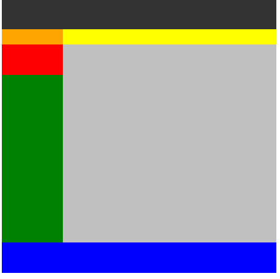

# 2024-10-21
---

# 오늘 공부 내용

## HTML 

## 태그

| 카테고리        | 태그                                    | 설명                                      |
|-----------------|-----------------------------------------|------------------------------------------|
| **문서 구조**    | `<!DOCTYPE html>`                       | HTML 문서의 타입을 선언                 |
|                 | `<html>`                                | HTML 문서의 루트 요소                   |
|                 | `<head>`                                | 메타데이터, 스크립트, 스타일 포함      |
|                 | `<title>`                               | 문서의 제목                             |
|                 | `<body>`                                | 웹 페이지의 내용                        |
| **텍스트 관련**  | `<h1>` ~ `<h6>`                        | 제목 태그 (h1이 가장 크고 h6가 가장 작음) |
|                 | `<p>`                                   | 단락                                    |
|                 | `<br>`                                  | 줄 바꿈                                 |
|                 | `<hr>`                                  | 수평선                                  |
|                 | `<strong>`                              | 중요 텍스트 (보통 굵게 표시)           |
|                 | `<em>`                                  | 강조 텍스트 (보통 기울임꼴)            |
|                 | `<blockquote>`                          | 인용구                                   |
|                 | `<ul>`                                  | 비순서 목록                             |
|                 | `<ol>`                                  | 순서 목록                               |
|                 | `<li>`                                  | 목록 항목                               |
|                 | `<dl>`                                  | 정의 목록                               |
|                 | `<dt>`                                  | 정의 항목                               |
|                 | `<dd>`                                  | 정의 설명                               |
| **링크 및 이미지**| `<a href="URL">`                      | 하이퍼링크                              |
|                 | ``   | 이미지                                   |
| **테이블 관련**  | `<table>`                               | 테이블                                   |
|                 | `<tr>`                                  | 테이블 행                               |
|                 | `<th>`                                  | 테이블 헤더 셀                         |
|                 | `<td>`                                  | 테이블 데이터 셀                       |
| **폼 관련**      | `<form>`                                | 입력 양식                               |
|                 | `<input>`                               | 입력 필드                               |
|                 | `<textarea>`                            | 여러 줄 입력 필드                      |
|                 | `<button>`                              | 버튼                                    |
|                 | `<select>`                              | 드롭다운 목록                          |
|                 | `<option>`                              | 목록의 옵션                             |
| **기타**        | `<div>`                                 | 블록 레벨 컨테이너                    |
|                 | `<span>`                                | 인라인 컨테이너                        |
|                 | `<script>`                              | 자바스크립트 코드                       |
|                 | `<link>`                                | 외부 스타일시트 연결                   |

## 블록 레벨 요소
- 전후 줄 바꿈이 들어가 다른 요소들을 다른 줄로 밀어내고 **혼자 한 줄을 차지**
특징
- 항상 새로운 라인에서 시작
- 화면 크기 전체의 가로 폭을 차지(width: 100%)
- weight, height, margin, padding 프로퍼티 지정이 가능하다.
- block 레벨 요소 내에 inline 레벨 요소를 포함할 수 있다.
- block 레벨 요소 예
  - div, h1 ~ h6, p, ol, ul, li, header, footer, section, article, aside, main, table, form, figure

## 인라인 레벨 요소
- 인 라인 레벨 요소는 전후 줄 바꿈 없이 한 줄에 **다른 요소들과 나란히 배치**
특징
- 새로운 라인에서 시작하지 않으며 문장의 중간에 들어갈 수 있다.
- 즉, 줄을 바꾸지 않고 다른 요소와 함께 한 행에 위치한다.
- **content의 너비만큼 가로 폭을 차지**
- widht, height 속성은 무시, margin 속성은 좌우 간격만 반영이 되고, 상하 간격은 반영이 되지 않는다.
  - margin-top, margin-bottom 속성은 무시
- padding 속성은 좌우 간격은 반영이 되고, 상하 간격 다른 영역을 침범한다.
- inline 레벨 요소 내에 block 레벨 요소를 포함 할 수 없다.
- inline 레벨 요소는 일반적으로 block 레벨 요소에 포함되어 사용된다.
- ex)
  - span, a, img, strong, em, code, cite, small, sub, time, b, i

## 특수문자
| 기호 | HTML 엔티티  | 설명             |
|------|--------------|------------------|
| `&`  | `&amp;`     | 앰퍼샌드         |
| `<`  | `&lt;`      | 작다             |
| `>`  | `&gt;`      | 크다             |
| `"`  | `&quot;`    | 큰따옴표        |
| `'`  | `&apos;`    | 작은따옴표      |
| ` `  | `&nbsp;`     | 공백             |
| `©`  | `&copy;`    | 저작권 심볼     |
| `®`  | `&reg;`     | 등록 상표       |
| `™`  | `&trade;`   | 상표            |
| `€`  | `&euro;`    | 유로 기호       |
| `£`  | `&pound;`   | 파운드 기호     |
| `¥`  | `&yen;`     | 엔화 기호       |
| `¢`  | `&cent;`    | 센트 기호       |
| `§`  | `&sect;`    | 단락 기호       |
| `¶`  | `&para;`    | 단락 기호       |
| `•`  | `&bull;`    | 점 기호         |
| `—`  | `&mdash;`   | 긴 대시         |
| `–`  | `&ndash;`   | 짧은 대시       |
| `°`  | `&deg;`     | 도 기호         |
| `≠`  | `&ne;`      | 같지 않음       |
| `≥`  | `&ge;`      | 크거나 같다      |
| `≤`  | `&le;`      | 작거나 같다      |
| `×`  | `&times;`   | 곱하기 기호     |
| `÷`  | `&divide;`  | 나누기 기호     |

ex)`&lt;br&gt;&lt;br&gt;`


data-*  개발자가 임의의 속성을 html 요소에 추가

<details>
  <summary>예시 코드 보기</summary>

```html
 <ul>
    <li data-subject="java">자바</li>
    <li data-subject="spring">스프링</li>
    <li data-subject="oracle">오라클</li>
  </ul>
```
</details>



<details>
  <summary>float 사용</summary>

```html
<!DOCTYPE html>
<html lang="en">
<head>
  <meta charset="UTF-8">
  <title>Title</title>

  <style type="text/css">
      * {
          margin: 0;
          padding: 0;
      }
  </style>

</head>
<body>

  <div style="width: 900px; margin: 20px auto;">

    <div style="height: 100px; background: #333;"></div>

    <div style="float:left; width: 200px; height: 500px">
        <div style="height: 50px; background: orange;"></div>
        <div style="height: 100px; background: red;"></div>
        <div style="height: 550px; background: green;"></div>
    </div>

    <div style="float:left; width: 700px;">
      <div style="height: 50px; background: yellow;"></div>
      <div style="height: 650px; background: silver;"></div>
    </div>

    <div style=" clear:both; height: 100px; background: blue;"></div>

  </div>

</body>
</html>

```
</details>

---
오늘 HTML 태그들에 대해서 공부를 하였다.
블록 레벨 요소와 인라인 요소들에 대한 특징들을 알았고
간단한 CSS 속성들을 넣으면서 태그들을 익혔다.
자바를 공부하다가 HTML을 하니 다소 쉬웠고 학부때 HTML에
대해서 조금은 알았기 때문에 수업을 여유롭게 들을 수 있었다.